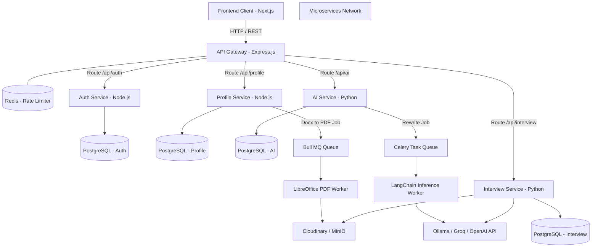
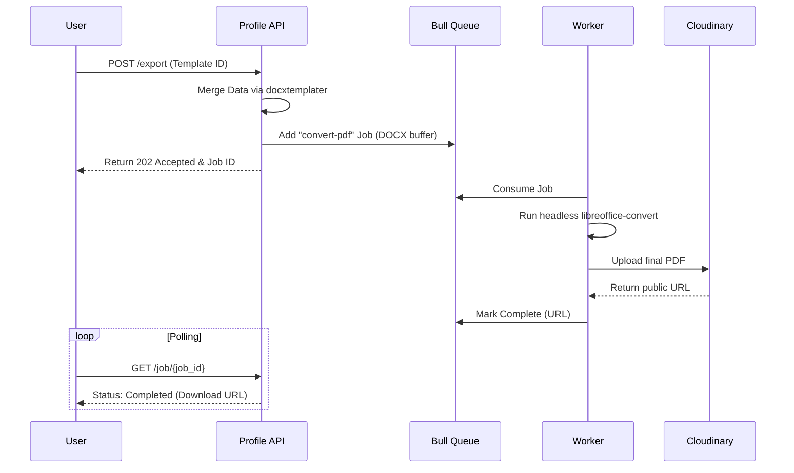
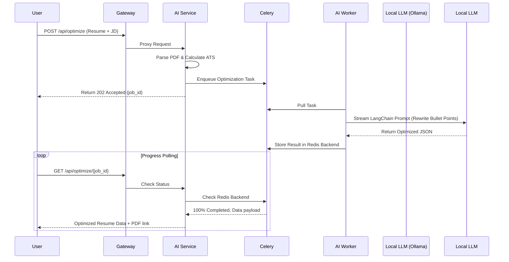
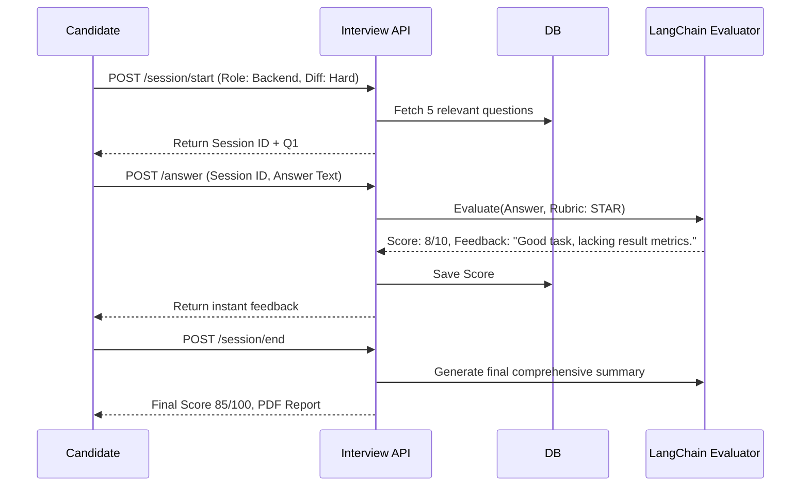

# ResumeForge-X

A comprehensive, microservices-based AI platform designed to revolutionize how candidates prepare for the job market. This repository contains all the backend microservices, the API gateway, and the modern frontend web application that power the ResumeForge-X ecosystem.

---

## 🎯 Objective & Problem Statement

### The Problem
In today's highly competitive job market, candidates face two major hurdles:
1. **Beating the ATS (Applicant Tracking Systems):** Most resumes are filtered out by automated systems before human eyes ever see them because they lack specific keywords or structural compliance. Standard resume builders provide static templates without intelligent insights.
2. **Interview Preparedness:** Practicing for technical, behavioral, and HR interviews is difficult. Human mock interviews are expensive, hard to schedule, and often lack objective, actionable feedback. 

### The Solution: ResumeForge-X
ResumeForge-X bridges this gap by providing an end-to-end, AI-driven career acceleration platform. 
- **Intelligent Resume Generation:** Users can manage their career profiles and dynamically generate ATS-optimized DOCX and PDF resumes using flexible templates.
- **AI-Powered ATS Scoring & Optimization:** The platform analyzes a user's resume against specific job descriptions, providing a detailed ATS score, identifying skill gaps, and utilizing Large Language Models (LLMs) to intelligently rewrite and optimize the resume content.
- **AI Mock Interviews:** A fully interactive mock interview engine that dynamically generates questions based on the role and difficulty, accepts text or audio answers, and uses LLMs to evaluate responses across multiple dimensions (relevance, depth, clarity, STAR format) to provide immediate, actionable feedback and session reports.

---

## 🏗️ How We Built It: Full System Architecture Design

ResumeForge-X is built on a highly scalable, decoupled **Microservices Architecture**. The fundamental design philosophy is **polyglot microservices**: utilizing the best technology for the specific workload. Node.js is utilized for high I/O routing and document mapping, while Python is leveraged for its heavy mathematical and NLP ecosystem.

### High-Level System Diagram

### Architectural Decisions
1. **Stateless Authentication at the Edge:** 
   The Auth Service issues cryptographically signed JSON Web Tokens (JWTs). The API Gateway and all microservices independently verify these tokens without needing to query a central database, ensuring ultra-low latency routing.
2. **Database per Service:** 
   To prevent "Spaghetti DB" coupling, every microservice has its own independent PostgreSQL schema. Data linking happens via a global `user_id` injected from the JWT payload.
3. **Message Queues for Heavy Workloads:** 
   - Converting a DOCX to a PDF is a CPU-blocking operation that would stall a Node.js server. We use **Bull MQ** (Redis) to offload this to background workers.
   - LLM generation (via LangChain) can take anywhere from 5 to 60 seconds. We use **Celery** (Redis) in the Python backend to queue these jobs, avoiding HTTP timeouts and allowing the frontend to gracefully poll for progress.

---

## 🧩 In-Depth Service Breakdown

### 1. AI Service (`ai-service`)
**Role:** The intelligent core responsible for document parsing, NLP-based ATS evaluation, and LLM-driven resume rewriting.
**Tech Stack:** Python 3.11, FastAPI, Celery, LangChain, spaCy, Sentence Transformers.
**Features:**
- **Resume Parsing:** Extracts structured data from PDFs using PyMuPDF.
- **ATS Scoring Engine:** Uses `spaCy` (NER) and Sentence Transformers (`all-MiniLM-L6-v2`) to calculate semantic cosine similarity between the resume text and the job description.
- **Tiered Fallback LLM Strategy:** Defaults to free local models (Ollama Llama-3) for zero-cost execution, automatically falling back to HuggingFace or OpenAI if local models are unavailable.
- **Async Caching:** Aggressively caches ATS scores (24h) and LLM rewrites (1h) using SHA-256 hashes of the Job Description to save compute.

### 2. Profile & Resume Builder Service (`profile-service`)
**Role:** Manages career profiles, portfolios, and orchestrates DOCX/PDF generation.
**Tech Stack:** Node.js, Express.js, Prisma ORM, Bull MQ, `docxtemplater`, `libreoffice-convert`.
**Features:**
- **Template Merging Pipeline:** Injects user PostgreSQL data into custom DOCX templates utilizing `docxtemplater`.
- **Heavy I/O Offloading:** Background Bull workers execute headless LibreOffice processes to output high-fidelity PDFs, pushing the final files to Cloudinary.

### 3. Interview Service (`interview-service`)
**Role:** Powers real-time AI mock interviews, generating questions, and grading answers.
**Tech Stack:** Python 3.11, FastAPI, LangChain, Groq API, MinIO.
**Features:**
- **LangChain Evaluation Pipeline:** Grades submitted answers against strict rubrics (Relevance, Depth, Clarity, STAR method adherence).
- **Multi-Modal Support:** Evaluates raw text or accepts audio uploads (saved to MinIO) which are transcribed and then processed.
- **Instant Micro-Feedback:** Provides an immediate 0-10 score per question and a comprehensive final summary report at the end of the session.

### 4. Authentication Service (`auth-service`)
**Role:** Dedicated identity provider.
**Tech Stack:** Node.js, Express.js, Prisma, Passport.js, JWT, `bcrypt`.
**Features:** Centralized user registration, hashing credentials, and issuing JWTs to enable stateless microservice authorization.

### 5. API Gateway (`api-gateway`)
**Role:** The unified reverse proxy and security barrier.
**Tech Stack:** Node.js, Express.js, `http-proxy-middleware`, `rate-limit-redis`.
**Features:** Sliding-window rate limiters backed by Redis to prevent abuse (especially crucial for AI endpoints), CORS negotiation, and centralized logging.

### 6. Frontend Web Application (`resumeforge`)
**Role:** The rich, interactive client-side application.
**Tech Stack:** Next.js 14, React 18, Zustand, React Query, TailwindCSS, Radix UI.
**Features:** Optimistic UI updates, long-polling dashboards for AI optimization progress, and complex multi-step wizards managed by React Hook Form + Zod.

---

## 🔄 Complete Workflows

### Workflow 1: Resume Generation (DOCX to PDF)
*This workflow demonstrates how we safely execute blocking background tasks without degrading API performance.*

### Workflow 2: AI Optimization (LLM Rewrite)
*This workflow showcases the asynchronous Python Celery pipeline for slow LLM inference.*

### Workflow 3: Mock Interview Session
*Real-time evaluation pipeline leveraging fast APIs.*

---

## 🛠️ Technology Stack Summary Matrix

| Category | Technologies |
| :--- | :--- |
| **Frontend Ecosystem** | Next.js 14, React, TypeScript, TailwindCSS, Zustand, React Query, Radix UI, Framer Motion |
| **Node.js Backends** | Express.js, TypeScript, Prisma ORM, Bull MQ, Passport.js, `docxtemplater`, `libreoffice-convert` |
| **Python Backends** | FastAPI, SQLAlchemy (Async), Alembic, Celery, `python-jose` |
| **Relational Databases**| PostgreSQL (Segmented by microservice boundaries) |
| **In-Memory & Queues**| Redis (Caching, Rate Limiting, Bull Broker, Celery Broker) |
| **AI / Machine Learning**| LangChain, OpenAI API, Ollama (Llama 3/Mistral), Groq API, spaCy, Sentence Transformers |
| **Object Storage** | Cloudinary (Images/Resumes), MinIO/Cloudflare R2 (Audio/Docs) |
| **Containerization** | Docker, Docker Compose |
